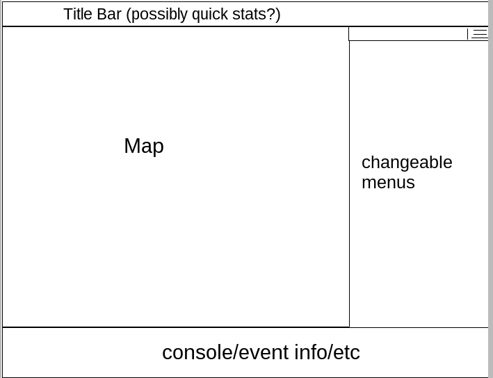

#Survive-Here

_Abstract_: A 2-D single player mystery/survival game built around the using the HERE Api for level creation. The user is plopped down into Chicago during a viral outbreak. They have to use their surroundings to survive. The surroundings and map tiles are generated using GPS coords sent to HERE's Map Service and Places API. The end goal is to finish the main quests. 
** *Note not all of the following will be implemented, but just lays out an eventual plan**

##Table of Contents:
1. [Story](#story)
1. [GUI](#gui)
1. [Login Form](#login)
1. [Player](#player)
	- Coordinates
	- Events Occured
	- Profession
	- Skills
	- Actions
	- Items
	- Vehicles
	- Stashes (Stretch)
1. [Map](#map)
1. [Places](#places)
1. [Events](#events)
1. [Quests](#quests)

##Story
1. Viral Oubreak that kills 98% of the world population. Our survivor wakes up not remembering anything but his name in a bed. On a table is a note "I did what I could, I wish I could stay to see if you get better, but there but I have to get the samples back to the lab. Meet me there after after wake up. - JD"

The survivor 

##GUI:
An example of the gui can be found in the images folder.

It is split into three horizontal sections. 
- Top: Title bar with possibly quick stats like current username
- Center: main screen; split into two, wider(left) being the map, the smaller(right) being a changeable menu screen for skills/inventory/etc
- Bottom: possibly console which states things that we could use alerts for but this allows us to show history + color code the text (use runescape as an example?)

##Login Form/Alert:
When website loads up, users are prompted for a username to login with. We have 5 character databases ready, one for each of the developers, one dummy, and one 'guest'.

Guest database wipes itself everytime it's loaded up. 
For everyone else, doing things(upgrading skills, getting items, etc) updates on the sql database in realtime. 

##Player:
###_Coordinates_:
A seperate thread runs in the background that updates the players coordinates after each action or time based event. 

If time based: Update coordinates after x seconds
If event based: Entering/Exiting Vehicle stores coordinates, Triggering an event stores coordinates, using an item stores coordinates, etc.

Coordinates are used during load time to determine where the map center is. 

###_Events Occured_:
A table which keeps track of all the events that have occured, how many times, outcome, and last time they occured. 
- Unique:	[Evt ID(int),Outcome(int),LastTimeExec(datetime)]
- Generic:  [Evt ID(int), TimesEncountered(int), LastTimeExec(datetime)]

After the player goes through an event, the event type is either generic or unique. Table corresponding to that type is updated with the info. Unique events log everytime that event occurs (as uniques have different outcomes), whereas generics just keep update times occurred, as the outcome will be the same each time. 

###_Profession_: 
At the beginning of the game the player chooses a profession which starts them off with points in certain skills, actions, and items. 
- Nurse
- Programmer
- Mechanic
- Police Officer
- Crook

###_Skills_: 
Skills are point based attributes a player has that act as threshold for being able to do certain actions, using certain items, etc. Think Fallout for this. Examples of skills:
- Firearms (ability to use guns)
- Melee (ability to use melee)
- Medicine (ability to use higher level first aid kits)
- Street Smarts (Lockpicking, Carjacking, etc)
- Computers (hacking)
- Stealth (chance of sneaking by monsters without having to fight)
- Survival (how much you need to eat, likelihood of finding food, etc)

###_Actions_:
In any given place and during any given time, you have certain number of actions available to you. These are contirbuted from your skills, profession, reading books, having items, etc. 
- If you have a firearm in your inventory, you may "shoot"
- If you read a science book, you may investigate a lab
- They can look at their phone for GPS / Journal entering (default thing everyone has) 

###_Items_:
Items can be stored in the players inventory(currently unlimited, future limited?). Possible "Stashing" skill could allow building small stashes in the world. 

Items are contained in the Item Database, which is an MySQL/XML doc containing large tabnle with the follwing Schema:
- Name: varchar(32): UNIQUE
- Type: varchar(32): Can be only of certain types (e.g. 'Weapon', 'Tool', 'Consumable')
- Description: varchar(max)
- Rarity: varchar(32): Can only of certain rarities
- Uses: int: Either Null, or has value (consumables)
	
###_Vehicles_:
You'll need vehicles to move at a decent speed. Time to traverse is real life /10. So a block takes approx 3 seconds to walk. Having a bike / car / etc can speed this up. Holding "Shift" makes you run / bike faster = more stamina gets eaten up. 

###_Stashes(Strech)_:
A possible stashing skill would allow storing "stashes" info, which will be a coordinate with an array of items stored in it. Allows you to store more items in it with possible events such as "your stash has been looted", "the food went rotten", etc. Stashes can be considered a type of _place_. 

##Map
A thread in the background watches for key strokes and moves the map, instead of the player. Have a check to make sure the player stays on roads so they aren't walking through walls.

"Look Around" button/key shoots out a circle with radius x, tinted blue(?) which sticks around for t seconds. Have a second daemon check for decay of those circles(?). While in an 'active' circle, the player can't use the 'look around' feature -to limit server lag and requests. 

In an active circle, the nearby venues are located and markers placed at those locations (Use Places API for this). If possible, store map with this data on player profile to save on requests?

If within x distance of given 'place', change player sprite to indicate that an event can be triggered. -> If 'go in' key is pressed, roll for event based on place stuff (see below). 

##Places
All places returned from the places + everything else is considered a 'place'. A place is a possible trigger for an event and has certain attributes: 
- _position_: position describes the geolocation of this particular place 
- _distance_: describes the distance from the original query location and this particular place 
- _title_: gives the name of the place 
- [_category_](#https://developer.here.com/rest-apis/documentation/places/topics/categories.html): explains the relevant category group for that place which helps describe it. All places have a category, for example eat-drink, going-out,sights-museums, and more
- _icon_: provides a URI for the relevant icon for this place category.
- _id_: is the specific id number for this place 

##Events:
Events database contains all events with their respective triggers and outcomes. 

Table: 
- ID (also used to label the js file for the event)
- Event Name
- Array of Event triggers

##Quests:
Quests are chains of encounters. Checks can be made to see which quests have been completed and which ones are available. Think watch dogs for linear vs sandbox type of gameplay.